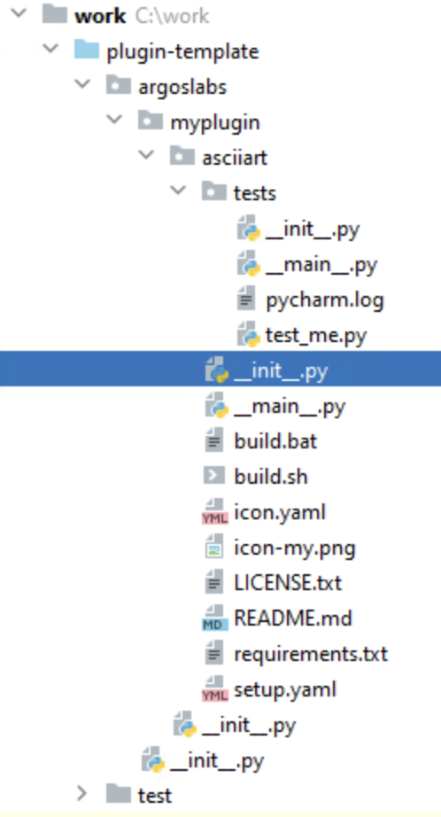

<<[Go to previous page](ARGOS_RPA_POT_SDK_on_Windows10.md)

# File Structure of the plugin



## Python Package
Python package consists with a folder with `__init__.py` file in it.

**IMPORTANT** ARGOS Low-Code plugin has the following naming rule:
* Package name has three sections separated by a period like `argoslabs.group.name`
* The first section must be `argoslabs` and this cannot be changed as it is the identifier in the ARGOS Low-code platform.
* You can set the group name, `group`. This can be any name as you like. However, making it meaningful to everyone is recommended.
* The `name` is the name of your plugin. ***However, this is NOT the display name on STU.*** Again, the more specific name is, the better.

> * `group` and `name` are only allowed with **lowercase alphabets and underbar character** which can be expressed by Regular Expression,  `[a-z_]`
> The POT SDK template has the package name of `argoslabs.demo.helloworld`
> Under `plugin-template` folder next folder structure may be seen as below:

## Plugin main files
```sh
plugin-template
+-- argoslabs
   +-- __init__.py
   +-- demo
      +-- __init__.py
      +-- helloworld
         +-- __init__.py
         +-- ...
```

All main files exists at third level of files like `argoslabs/demo/helloworld`.

* `__init__.py`: plugin's actual code
* `__main__.py`: plugin's starting code
* `build.bat` and `build.sh`: building script, `.bat` is for `Windows` and `.sh` is for Linux or MacOS
* `icon.yaml` and `icon-my.png`: These files are related to make `icon.png` result file
* `LICENSE.txt`: License description of this plugin
* `README*.*`: Files starting with `README` are related with help document of this plugin
* `requirements.txt`: Contains list of dependent third party python modules
* `setup.yaml`: Configuration of this plugin

## Plugin test files
```sh
plugin-template
+-- argoslabs
   +-- __init__.py
   +-- demo
      +-- __init__.py
      +-- helloworld
         +-- __init__.py
         +-- tests
            +-- test_me.py
```

All files at `argoslabs/demo/helloworld/tests` are related to test plugin code.

There is only one important file:
* `test_me.py`: Plugin testing code using python's unittest

<<[Go to previous page](ARGOS_RPA_POT_SDK_on_Windows10.md)
